# [Giangbb Studio]

# WEB DEVELOPMENT COURSE

Series of lectures and projects for studying & practicing HTML, Javascript, CSS5, and Nodejs

# LECTURES

  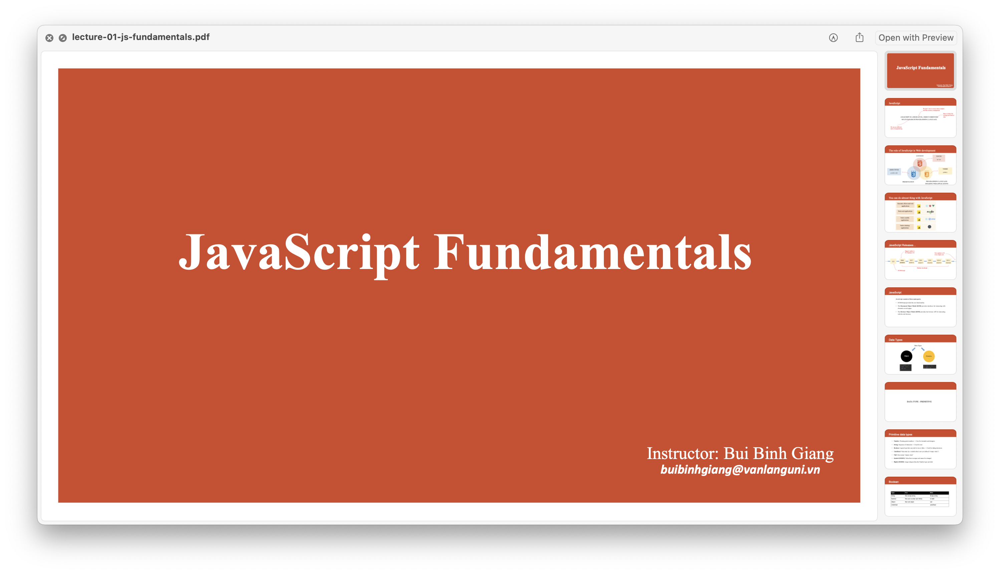
  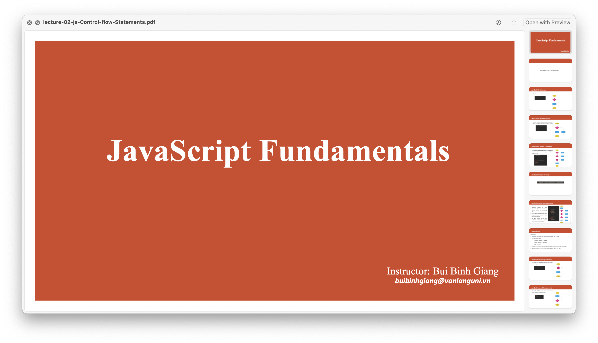
  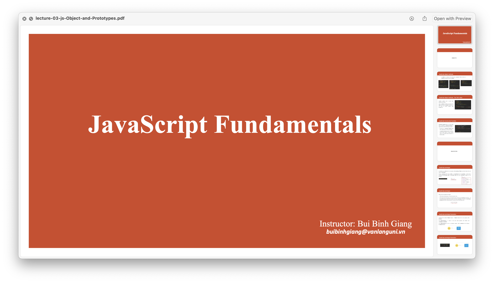
  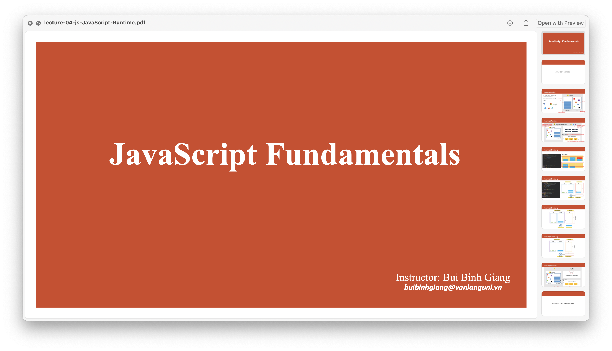
  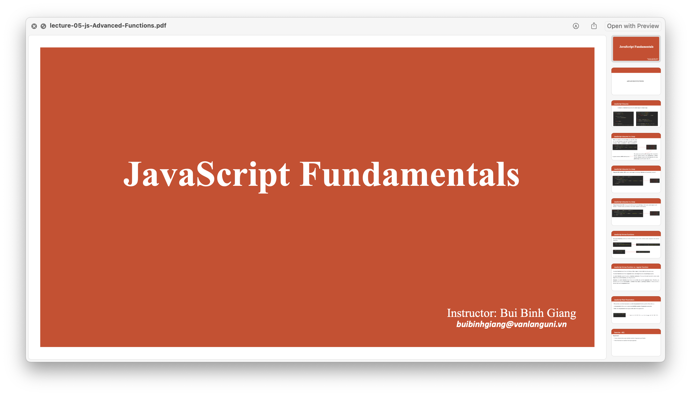
  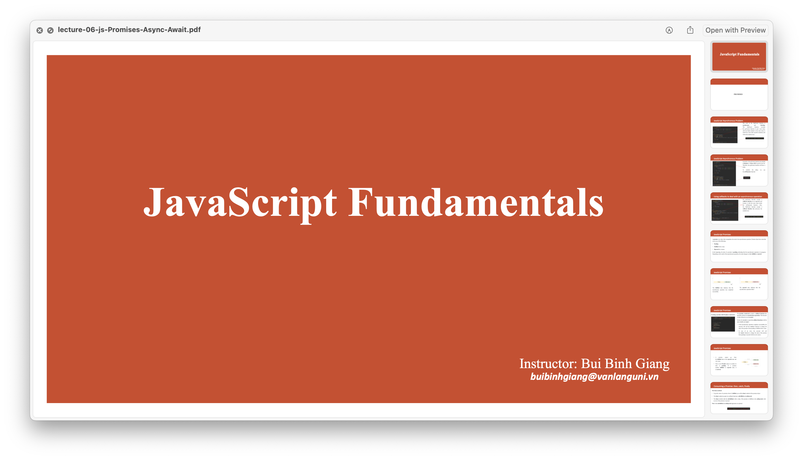
  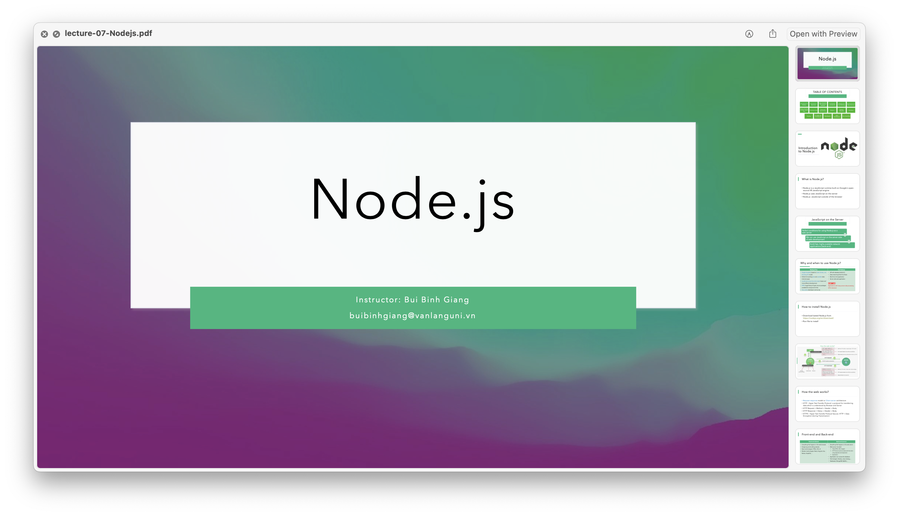
  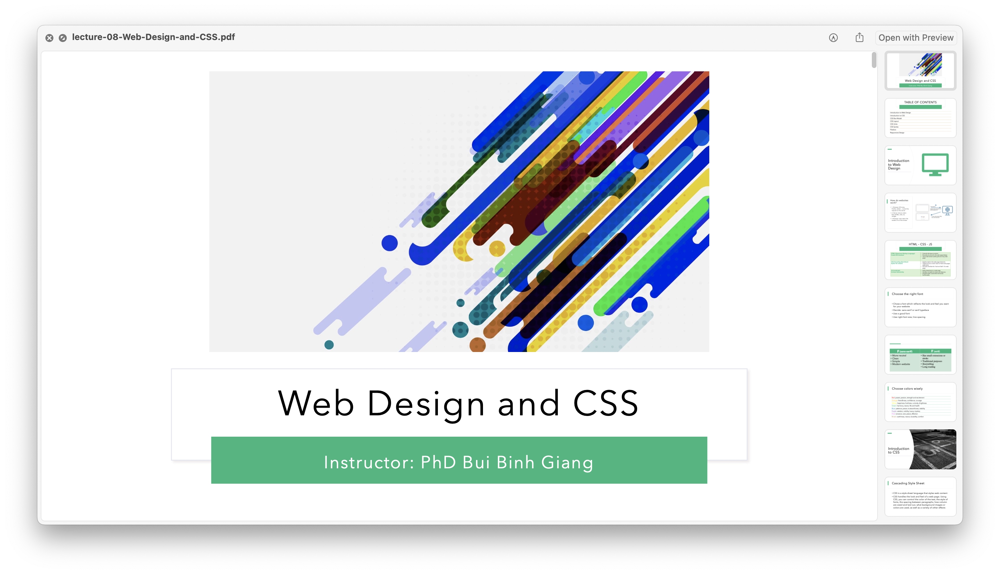

# PRACTICE

  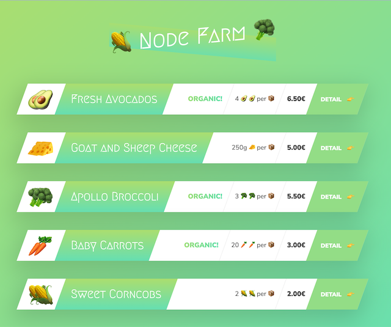
  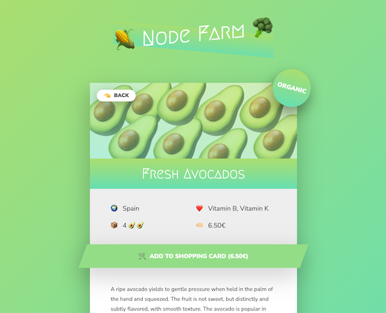

  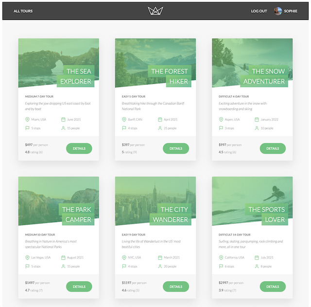
  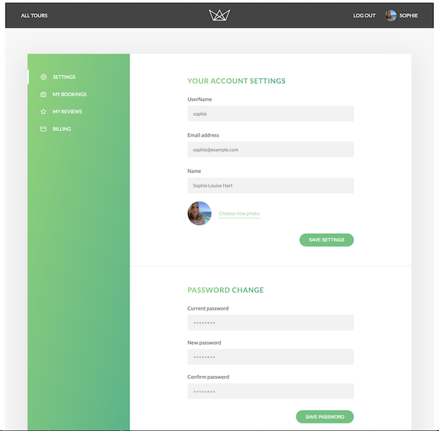
  
  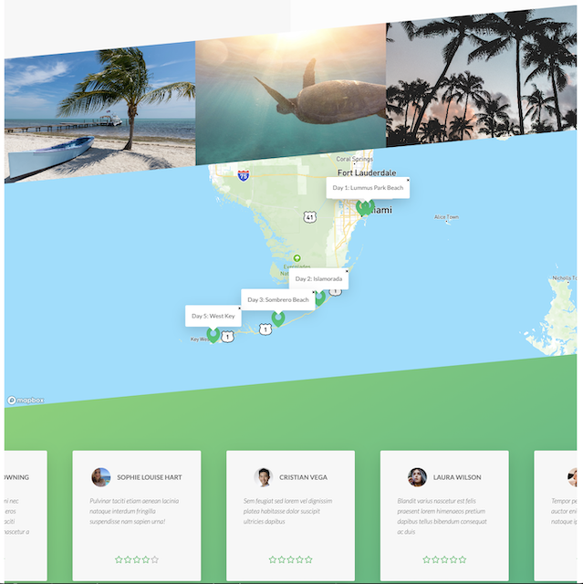

